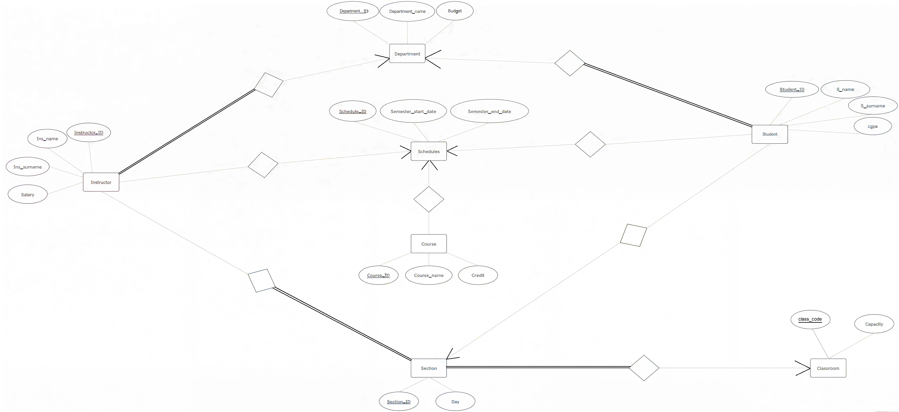

# CMPE343 University Database Management System

## Project Members
- Mert Yorulmaz 22314700
- Furkan Uzun 22207964
- Umut Sevinç 22207663
- Tahir Demir 22205579

## Project Description
This project is a University Database Management System designed for CMPE343 course.

## Technologies
- Postgres SQL , MySQL
- Supabase (Cloud Database)
- GitHub

## Repository Structure
- ERD: ER Diagram
- DDL: Table creation
- DML: Insert, update, delete
- QUERIES: SQL queries

## ER Diagram

## Data Definition Language (DDL)
The table creation operations can be found here:
➡️ [DDL](DDL/DDL.sql)

## Data Manupilation Language (DML)
Data manipulation operations can be found here:
➡️ [DML](DML/DML.sql)

## SQL Queries
SQL Queries can be found here:
➡️ [SQL QUERIES](SQL_QUERIES/SQL_QUERIES.sql)

